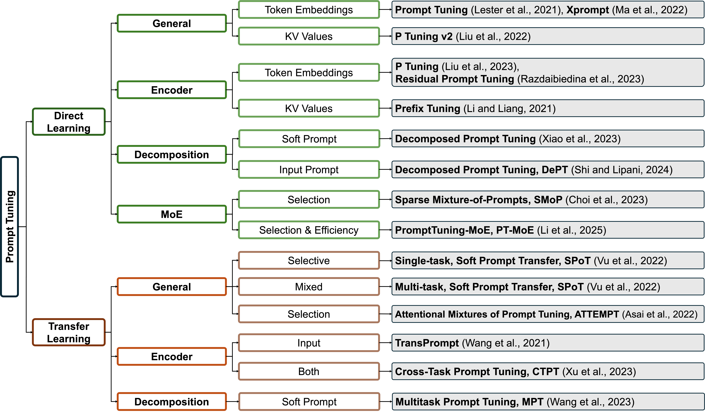
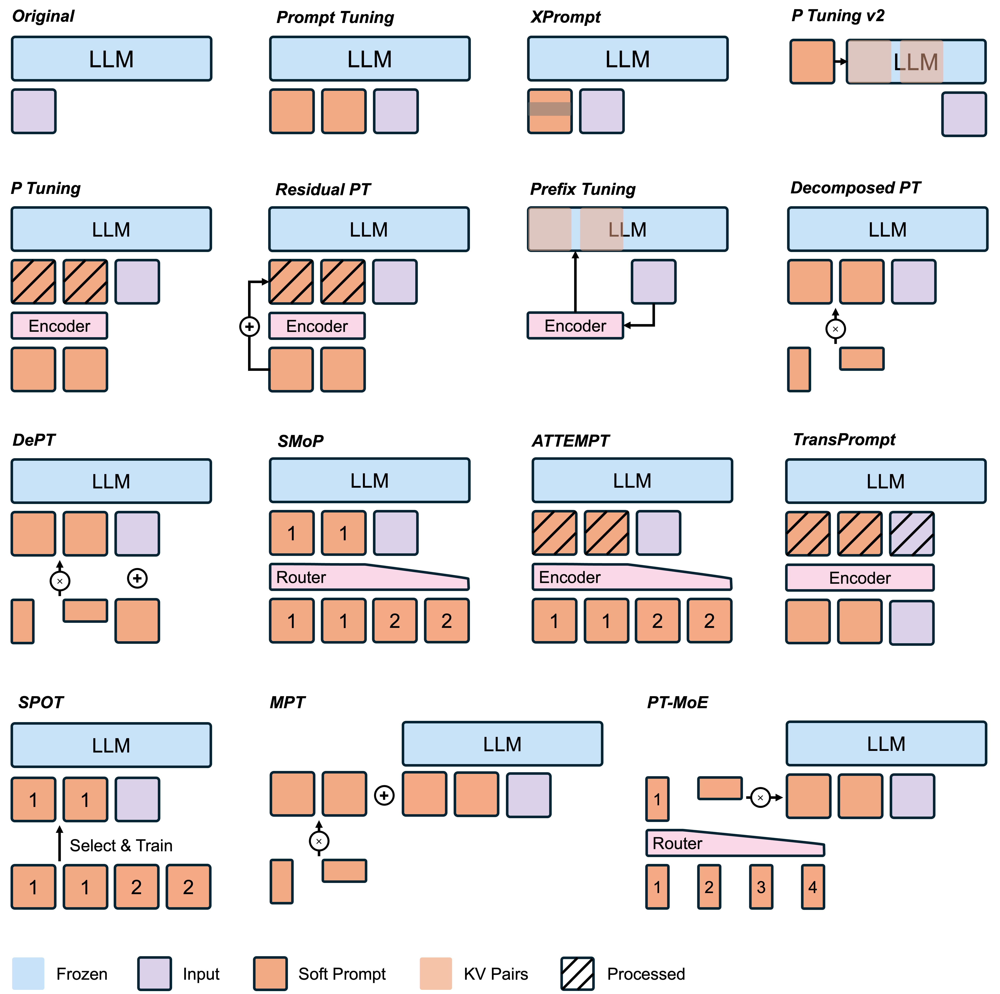

# [ICML 2025 Workshop] A Survey on Prompt Tuning

<p align="center">
  <b>Content</b>
</p>

<p align="center">
  <a href="#news">🚀 News</a> •
  <a href="#todo">✏️ Todo</a> •
  <a href="#introduction">✨ Introduction</a>
</p>

<p align="center">
  <a href="#tree overview">🌳 Tree Overview</a> •
  <a href="#paper list">📖 Paper List</a>
  <a href="#visualisations">🎨 Visualisations</a>
</p>

<p align="center">
  <a href="#citation">📌 Citation</a> •
  <a href="#license">🔖 License</a>
</p>
<div id="news">&nbsp;</div>

<p align="center">
  <b>Links</b>
</p>

<p align="center">
  <a href="https://github.com/ZongqianLi/Prompt-Tuning-Survey/blob/main/README.md">Project Page</a> •
  <a href="https://www.arxiv.org/abs/2507.06085">Paper</a>
</p>


## 🚀 News

- **[2025.06.11]** This paper is accepted by ICML 2025 Workshop.
- **[2025.02.05]** This page is created.

<div>&nbsp;</div>
<div>&nbsp;</div>
<div id="todo">&nbsp;</div>


## ✏️ Todo


<div>&nbsp;</div>
<div>&nbsp;</div>
<div id="introduction">&nbsp;</div>


## ✨ Introduction

This survey reviews prompt tuning, a parameter-efficient approach for adapting language models by prepending trainable continuous vectors while keeping the model frozen. We classify existing approaches into two categories: direct prompt learning and transfer learning. Direct prompt learning methods include: general optimization approaches, encoder-based methods, decomposition strategies, and mixture-of-experts frameworks. Transfer learning methods consist of: general transfer approaches, encoder-based methods, and decomposition strategies. For each method, we analyze method designs, innovations, insights, advantages, and disadvantages, with illustrative visualizations comparing different frameworks. We identify challenges in computational efficiency and training stability, and discuss future directions in improving training robustness and broadening application scope.

<div>&nbsp;</div>
<div>&nbsp;</div>
<div id="tree overview">&nbsp;</div>


## 🌳 Tree Overview

<p align="left">
  
</p>

Hierarchical overview of prompt tuning methods including direct learning and transfer learning.

<div>&nbsp;</div>
<div>&nbsp;</div>
<div id="paper list">&nbsp;</div>


## 📖 Paper List

### Direct Learning:

- **General:**

  - Token Embeddings: 

    - [[Prompt Tuning](https://aclanthology.org/2021.emnlp-main.243/)] The Power of Scale for Parameter-Efficient Prompt Tuning
    - [[Xprompt](https://aclanthology.org/2022.emnlp-main.758/)] Exploring the Extreme of Prompt Tuning

  - KV Values:

    - [[P Tuning v2](https://aclanthology.org/2022.acl-short.8/)] Prompt Tuning Can Be Comparable to Fine-tuning Across Scales and Tasks
   
- **Encoder:**

  - Token Embeddings: 

    - [[P Tuning](https://arxiv.org/abs/2103.10385)] GPT Understands, Too
    - [[Residual Prompt Tuning](https://aclanthology.org/2023.findings-acl.421/)] Improving prompt tuning with residual reparameterization

  - KV Values:

    - [[Prefix Tuning](https://aclanthology.org/2021.acl-long.353/)] Optimizing Continuous Prompts for Generation

- **Decomposition:**

  - Soft Prompt:
 
    - [[Decomposed Prompt Tuning](https://aclanthology.org/2023.findings-emnlp.890/)] Decomposed Prompt Tuning via Low-Rank Reparameterization
 
  - Input Prompt:
 
    - [[DePT](https://openreview.net/forum?id=KjegfPGRde)] Decomposed Prompt Tuning for Parameter-Efficient Fine-tuning
 
- **MoE:**

  - Selection:
 
    - [[SMoP](https://aclanthology.org/2023.emnlp-main.884/)] Towards Efficient and Effective Prompt Tuning with Sparse Mixture-of-Prompts
 
  - Selection & Efficiency:
  
    - [[PT-MoE](https://arxiv.org/abs/2505.09519)] PT-MoE: An Efficient Finetuning Framework for Integrating Mixture-of-Experts into Prompt Tuning

### Transfer Learning:

- **General:**

  - Selective:
 
    - [[Single-task, SPoT](https://aclanthology.org/2022.acl-long.346/)] Better Frozen Model Adaptation through Soft Prompt Transfer
 
  - Mixed:
 
    - [[Multi-task, SPoT](https://aclanthology.org/2022.acl-long.346/)] Better Frozen Model Adaptation through Soft Prompt Transfer
 
  - Selection:
 
    - [[ATTEMPT](https://aclanthology.org/2022.emnlp-main.446/)] Parameter-Efficient Multi-task Tuning via Attentional Mixtures of Soft Prompts

- **Encoder:**

  - Input:
 
    - [[TransPrompt](https://aclanthology.org/2021.emnlp-main.221/)] Towards an Automatic Transferable Prompting Framework for Few-shot Text Classification
 
  - Both:
 
    - [[CTPT](https://aclanthology.org/2023.findings-emnlp.780/)] Efficient Cross-Task Prompt Tuning for Few-Shot Conversational Emotion Recognition

- **Decomposition:**

  - Soft Prompt:
 
    - [[MPT](https://openreview.net/forum?id=Nk2pDtuhTq)] Multitask Prompt Tuning Enables Parameter-Efficient Transfer Learning

<div>&nbsp;</div>
<div>&nbsp;</div>
<div id="visualisations">&nbsp;</div>


## 🎨 Visualisations

<p align="left">
  
</p>

Illustration of different prompt tuning (PT) methods. Prompt Tuning directly prepends soft prompts to input. XPrompt applies pruning to soft prompts. P-Tuning v2 and Prefix Tuning incorporate prompts or KV pairs across all the layers of the language model. P-Tuning and Residual PT use encoders to process soft prompts. Decomposed PT and DePT leverage matrix decomposition strategies. SPoT leverages pre-trained prompts from source tasks, ATTEMPT or CTPT utilizes prompt mixing, TransPrompt uses encoders for task-specific and universal knowledge, while MPT decomposes prompts into shared and task-specific components.

<div>&nbsp;</div>
<div>&nbsp;</div>
<div id="citation">&nbsp;</div>


## 📌 Citation

```
@misc{li2025surveyprompttuning,
      title={A Survey on Prompt Tuning}, 
      author={Zongqian Li and Yixuan Su and Nigel Collier},
      year={2025},
      eprint={2507.06085},
      archivePrefix={arXiv},
      primaryClass={cs.CL},
      url={https://arxiv.org/abs/2507.06085}, 
}
```

<div>&nbsp;</div>
<div>&nbsp;</div>
<div id="license">&nbsp;</div>


## 🔖 License

```

```


